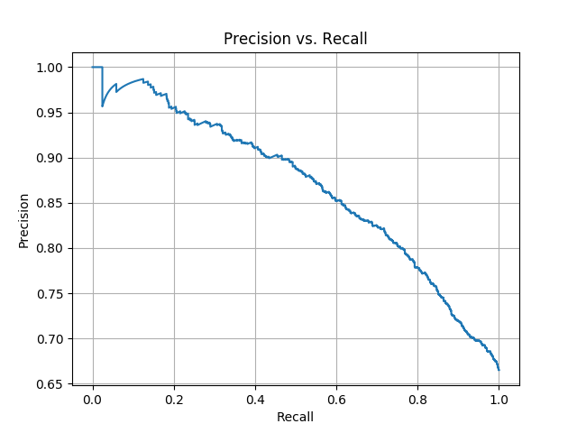
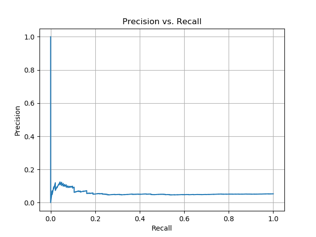

# CR-CNN-PyTorch
An **Un-official** CR-CNN Relation Classification model implementation via PyTorch. 

CR-CNN is a model proposed by CN Santos. The full paper can be found at below:

- [[Paper](https://www.aclweb.org/anthology/P15-1061)] dos Santos, Cicero, Bing Xiang, and Bowen Zhou. "Classifying Relations by Ranking with Convolutional Neural Networks." *Proceedings of the 53rd Annual Meeting of the Association for Computational Linguistics and the 7th International Joint Conference on Natural Language Processing (Volume 1: Long Papers)*. 2015.

## Usage
If GPU resource is needed, you can set the `GPU_DEVICE_NUM` in `local_config.py` file.
If you are using GPU to train, then the device in `test.py` must be set to `GPU` too.

## Results

### WordEmbedding: 50 & Pos Embedding: 5

A middle result in training set shows that the model is overfitted, but it has a strong ability to fit with fast training process. So if you can finetune the model (probabily the position embedding dimension) or use a more powerful pretrained embedding, the result will grow better.
```
 [99,   120] AVG-Loss: 0.7125 - TRAIN >>> ACC: 0.8539, Precision: 0.8539, Recall: 0.8539, F1-micro: 0.8539, F1-macro: 0.7998
```

Here is the final result:
```
                           precision    recall  f1-score   support
                                                                   
  Product-Producer(e2,e1)     0.6019    0.5041    0.5487       123
                    Other     0.3779    0.4736    0.4203       454
 Member-Collection(e1,e2)     0.6667    0.1875    0.2927        32
 Content-Container(e1,e2)     0.7725    0.8431    0.8063       153
  Product-Producer(e1,e2)     0.7143    0.6019    0.6533       108
     Entity-Origin(e2,e1)     0.8750    0.7447    0.8046        47
 Member-Collection(e2,e1)     0.7758    0.8607    0.8160       201
     Message-Topic(e2,e1)     0.6875    0.4314    0.5301        51
 Content-Container(e2,e1)     0.8696    0.5128    0.6452        39 
   Component-Whole(e2,e1)     0.6232    0.5733    0.5972       150
   Component-Whole(e1,e2)     0.7793    0.6975    0.7362       162
Entity-Destination(e2,e1)     0.0000    0.0000    0.0000         1
     Message-Topic(e1,e2)     0.7059    0.8000    0.7500       210 
     Entity-Origin(e1,e2)     0.6904    0.6445    0.6667       211
Entity-Destination(e1,e2)     0.7911    0.7938    0.7925       291
 Instrument-Agency(e1,e2)     0.6667    0.0909    0.1600        22 
      Cause-Effect(e2,e1)     0.8000    0.8660    0.8317       194
 Instrument-Agency(e2,e1)     0.6271    0.5522    0.5873       134
      Cause-Effect(e1,e2)     0.8571    0.7612    0.8063       134
                                                                   
                 accuracy                         0.6651      2717
                macro avg     0.6780    0.5757    0.6024      2717
             weighted avg     0.6775    0.6651    0.6643      2717
             
TEST >>> ACC: 0.6651, Precision: 0.6651, Recall: 0.6651, F1-micro: 0.6651, F1-macro: 0.6024   


TEST >>> AUC: 0.8681
```


### Word Embedding: 300 & Pos Embedding: 100

```
word_vectors : 300 21772
                           precision    recall  f1-score   support

      Cause-Effect(e2,e1)     0.8776    0.8866    0.8821       194
      Cause-Effect(e1,e2)     0.9435    0.8731    0.9070       134
 Content-Container(e2,e1)     0.8000    0.6154    0.6957        39
 Content-Container(e1,e2)     0.7514    0.8693    0.8061       153
  Product-Producer(e2,e1)     0.7282    0.6098    0.6637       123
 Member-Collection(e2,e1)     0.7778    0.9055    0.8368       201
  Product-Producer(e1,e2)     0.7857    0.7130    0.7476       108
                    Other     0.4525    0.4824    0.4670       454
 Member-Collection(e1,e2)     0.7857    0.3438    0.4783        32
 Instrument-Agency(e1,e2)     0.6667    0.0909    0.1600        22
   Component-Whole(e2,e1)     0.6899    0.7267    0.7078       150
Entity-Destination(e1,e2)     0.8173    0.8763    0.8458       291
     Entity-Origin(e2,e1)     0.9000    0.7660    0.8276        47
     Entity-Origin(e1,e2)     0.7709    0.8294    0.7991       211
Entity-Destination(e2,e1)     0.0000    0.0000    0.0000         1
 Instrument-Agency(e2,e1)     0.7500    0.6493    0.6960       134
     Message-Topic(e1,e2)     0.8028    0.8333    0.8178       210
     Message-Topic(e2,e1)     0.7879    0.5098    0.6190        51
   Component-Whole(e1,e2)     0.8400    0.7778    0.8077       162

                 accuracy                         0.7365      2717
                macro avg     0.7330    0.6504    0.6718      2717
             weighted avg     0.7400    0.7365    0.7331      2717

TEST >>> ACC: 0.7365, Precision: 0.7365, Recall: 0.7365, F1-micro: 0.7365, F1-macro: 0.6718

TEST >>> AUC: 0.9017
```

